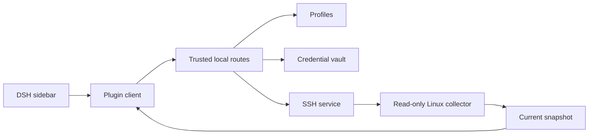

# 📦 @goodandready/dsh-server-monitor

<div align="center">

<h3>Standalone Read-Only Linux Server Monitor for DeepSeek Harness</h3>

<p align="center">
  <a href="https://www.npmjs.com/package/@goodandready/dsh-server-monitor"></a>
  <a href="LICENSE"></a>
  <a href="https://github.com/topics/dsh-plugin"></a>
  <a href="https://nodejs.org"></a>
</p>

<p align="center">
  <a href="https://goodandready.app/"></a>
</p>

<p align="center">
  <a href="README.md"><b>🇬🇧 English</b></a> •
  <a href="README.zh.md"><b>🇨🇳 中文说明</b></a> •
  <a href="README.ru.md"><b>🇷🇺 Русский</b></a>
</p>

<table align="center">
  <tr>
    <td align="center">
      ⭐ <strong>If you like this plugin, please star it on GitHub</strong> — it shows me that the plugin is useful to you and motivates me to keep developing it.
      <br><br>
      🐛 <strong>If you find a bug or would like to request a feature</strong>, open a GitHub issue in any language — I will review your proposal and implement useful suggestions in a future plugin version.
    </td>
  </tr>
</table>

</div>

---

A standalone, read-only Linux server monitor for the DeepSeek Harness sidebar. This package owns its server profiles and credentials; it does not depend on `dsh-remote-workspace` or reuse another plugin’s connection settings.

## MVP scope

- Add and manage multiple Linux SSH profiles.
- Connect with an SSH private key (inline or server-side key path) or password authentication.
- Generate Ed25519 SSH keys directly in the UI, copy a ready-to-use setup command for target servers, and verify the connection.
- Show current host, CPU, memory, swap, disk, process, container, network, and listening-port data.
- Refresh every 15 seconds while the sidebar is visible.
- Read-only monitoring: the plugin does not manage remote services, processes, or containers. History, charts, and alerts are not part of the MVP.

## Credential boundary

Credentials belong to this plugin and are stored in its private vault on the DSH host. On POSIX hosts the plugin enforces and verifies owner-only mode `0600`, and stops if that permission cannot be established. SSH keys generated via the UI are saved to `~/.dsh/keys/id_ed25519_dsh` (directory `0700`, file `0600`). Secret values and private keys are never written to DSH settings or returned to the browser; profile APIs expose only masked values and presence flags. A configured private-key path is read on the DSH host.

## Development checks

Run the same checks used by Gitea Actions:

```sh
npm ci
npm test
```

Tests use mocked SSH connections and do not connect to real servers. The Gitea Actions workflow runs these commands for pushes and pull requests.

## Languages

The plugin UI ships English and Chinese dictionaries and uses the DSH locale service, allowing `dsh-russian-lang` to supply Russian translations. See [README.zh.md](README.zh.md) and [README.ru.md](README.ru.md).
## Requirements

- A DSH web profile with the plugin installed and SSH reachability from DSH to each Linux host.
- A remote account allowed to run standard read-only system commands. Docker/Podman data requires permission to query that runtime.
- A private-key path must be readable by the DSH service account on the DSH host.

## Install

Replace `web` with your DSH profile:

```sh
dsh plugin --profile web add @goodandready/dsh-server-monitor
```

Follow the CLI prompts. In the plugin settings card, add a server, choose key or password authentication, test the connection, and save. Open **Server Monitor** in the sidebar. Remove with `dsh plugin --profile web remove @goodandready/dsh-server-monitor`.

## Configuration

Manage profiles in the DSH settings card. Settings contain connection metadata only: do not place passwords, private-key contents, or passphrases in settings or config files.

| Field | Type | Default | Meaning |
| --- | --- | --- | --- |
| `profiles` | array | `[]` | Plugin-owned SSH profiles. |
| `profiles[].id` | string | generated | Stable profile ID. |
| `profiles[].name` | string | empty | Display name. |
| `profiles[].host` | string | empty | Linux host reachable from DSH. |
| `profiles[].port` | number | `22` | SSH port. |
| `profiles[].username` | string | `root` | Remote account; prefer restricted permissions. |
| `profiles[].authType` | string | `key` | `key` or `password`. |
| `profiles[].privateKeyPath` | string | empty | Optional key path on the DSH host. |
| `activeProfileId` | string | empty | Selected profile ID. |

The settings card stores secret values in the plugin-owned vault on the DSH host. POSIX vault operations require verified owner-only permissions (`0600`).

### SSH key generation and sharing with other plugins

You can generate a dedicated Ed25519 keypair directly from the settings card by clicking **Generate SSH key**. The private key is saved on the DSH host at `~/.dsh/keys/id_ed25519_dsh` (mode `0600`). The UI displays the public key and a one-line setup command to paste on your target server. Once executed, click **Command ran — test connection** to test connectivity immediately.

This key path can also be configured in other local plugins such as `dsh-remote-workspace` to share the same management key without duplicating credentials.

## Collected data

The bounded, read-only collector reports host/OS/kernel/CPU, load and uptime, memory and swap, mounted filesystem usage, up to 12 CPU-heavy processes, running Docker or Podman containers, network byte/packet counters, and listening TCP/UDP ports (`ss`, falling back to `netstat`). A section can be empty if a command, runtime, or permission is unavailable.

## Architecture



| Module | Responsibility |
| --- | --- |
| `lib/index.js` | Cordis registration, settings, service lifecycle. |
| `lib/client.js` | Sidebar/settings UI; pauses polling while hidden. |
| `lib/routes.js` | Trusted-request checks, profile operations, snapshot cache. |
| `lib/profile.js` | Profile normalization and validation. |
| `lib/vault-service.js` | Credential storage and POSIX permission verification. |
| `lib/ssh-service.js` | SSH authentication, bounded commands, reuse and cleanup. |
| `lib/linux-collector.js` | Linux collection and snapshot parsing. |
| `lib/plugin-updater.js` | Version checking and one-click in-card plugin updates. |

## Internal HTTP routes

These DSH-client routes are protected by a trusted-request check; they are not a public or remote-management API.

| Method | Path | Purpose |
| --- | --- | --- |
| GET | `/dsh-server-monitor/state` | Sanitized profiles and selected ID. |
| GET | `/dsh-server-monitor/snapshot?profileId=<id>` | Current snapshot; defaults to active profile. |
| GET | `/dsh-server-monitor/update` | Current and latest version status. |
| POST | `/dsh-server-monitor/update` | Run one-click plugin update via DSH CLI. |
| POST | `/dsh-server-monitor/profiles/save` | Create/update a profile. |
| POST | `/dsh-server-monitor/profiles/delete` | Delete profile and stored secrets. |
| POST | `/dsh-server-monitor/profiles/active` | Select active profile. |
| POST | `/dsh-server-monitor/keys/generate` | Generate Ed25519 keypair in `~/.dsh/keys` (0600) and return public key + setup command. |
| POST | `/dsh-server-monitor/test` | Test SSH connection. |

Snapshots are cached per profile for 15 seconds from collection start; concurrent requests share a collection. Save/delete invalidates that profile’s cache.

## Security and support

The plugin owns its SSH credentials, never returns secrets to the browser, and only runs read-only monitoring commands. Linux only; history, charts, alerts, and remote actions are not in the MVP.

- Issues: [GitHub Issues](https://github.com/GooDAnDReaDY/dsh-server-monitor/issues)
- License: [MIT](LICENSE)

## Visual verification


