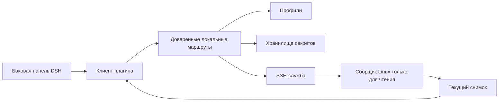

# 📦 @goodandready/dsh-server-monitor

<div align="center">

<h3>Автономный read-only монитор Linux-серверов для DeepSeek Harness</h3>

<p align="center">
  <a href="https://www.npmjs.com/package/@goodandready/dsh-server-monitor"></a>
  <a href="LICENSE"></a>
  <a href="https://github.com/topics/dsh-plugin"></a>
  <a href="https://nodejs.org"></a>
</p>

<p align="center">
  <a href="https://goodandready.app/"></a>
</p>

<p align="center">
  <a href="README.md"><b>🇬🇧 English</b></a> •
  <a href="README.zh.md"><b>🇨🇳 中文说明</b></a> •
  <a href="README.ru.md"><b>🇷🇺 Русский</b></a>
</p>

<table align="center">
  <tr>
    <td align="center">
      ⭐ <strong>Если плагин вам полезен, поставьте звёздочку на GitHub</strong> — это показывает востребованность решения и мотивирует развивать проект дальше.
      <br><br>
      🐛 <strong>Если вы нашли ошибку или хотите предложить улучшение</strong>, создайте issue на GitHub на любом языке — предложения рассматриваются для будущих версий плагина.
    </td>
  </tr>
</table>

</div>

---

Независимый плагин мониторинга Linux-серверов только для чтения в боковой панели DeepSeek Harness. Он хранит собственные профили и учётные данные и не зависит от `dsh-remote-workspace` или подключений других плагинов.

## Объём MVP

- Добавление и управление SSH-профилями Linux, macOS, BSD и Windows OpenSSH.
- Подключение по приватному SSH-ключу (содержимое или путь на хосте DSH) либо по паролю.
- Генерация SSH-ключей Ed25519 прямо из интерфейса, готовая команда настройки для целевых серверов и мгновенная проверка подключения.
- Текущие сведения о хосте, CPU, памяти, swap, дисках, процессах, контейнерах, сети и слушающих портах.
- Обновление каждые 15 секунд, пока боковая панель видима.
- Фоновые пробы не управляют удалёнными службами, процессами и контейнерами. Последний час рисуется спарклайнами, и оператор может открыть один интерактивный терминал.

## Граница хранения секретов

Учётные данные принадлежат этому плагину и хранятся в его отдельном хранилище на хосте DSH. В POSIX-системах плагин устанавливает и проверяет права только для владельца (`0600`); если обеспечить их не удаётся, операция прекращается. SSH-ключи, сгенерированные через интерфейс, сохраняются в `~/.dsh/keys/id_ed25519_dsh` (каталог `0700`, файл `0600`). Секреты и приватные ключи не записываются в настройки DSH и не возвращаются браузеру: API отдаёт только маскированные значения и признаки наличия секрета. Файл приватного ключа читается на хосте DSH.

## Проверки разработки

Запустите те же проверки, что выполняет Gitea Actions:

```sh
npm ci
npm test
```

Тесты используют имитацию SSH и не подключаются к реальным серверам. Gitea Actions запускает эти команды при push и создании pull request.

## Языки

В интерфейсе есть английский и китайский словари; используется locale-сервис DSH, чтобы `dsh-russian-lang` мог предоставить русский перевод. См. также [README.md](README.md) и [README.zh.md](README.zh.md).
## Требования

- Профиль DSH web с плагином; хост DSH должен иметь SSH-доступ к Linux-серверам.
- Удалённой учётной записи нужны права на стандартные команды только для чтения; для контейнеров необходим доступ к Docker/Podman.
- Файл приватного ключа должен находиться на хосте DSH и читаться системной учётной записью DSH.
- **Runtime-зависимость (`ssh2`)**: Для SSH-сессий и генерации ключей Ed25519 плагину требуется `ssh2` (`^1.17.0`) в секции `dependencies` (а не peer). Пакет автоматически устанавливается из реестра при добавлении плагина.
- **Чистый JavaScript (Pure JS Fallback)**: Компилятор C/C++ или Python на хосте DSH не требуется. В состав `ssh2` входят опциональные нативные модули (`cpu-features`, `sshcrypto`), но при их отсутствии или невозможности компиляции пакет без ошибок и прозрачно использует встроенную реализацию на чистом JavaScript.
- **Офлайн-установка (Air-Gapped)**: При установке из архива `.tgz` в изолированном контуре убедитесь, что `ssh2` и её транзитивные зависимости заранее загружены в локальный кэш пакетного менеджера или доступны через внутреннее npm-зеркало.

## Установка

Замените `web` на имя используемого профиля DSH:

```sh
dsh plugin --profile web add @goodandready/dsh-server-monitor
```

Следуйте подсказкам CLI. В карточке настроек добавьте сервер, выберите ключ или пароль, проверьте подключение и сохраните профиль. Затем откройте **Server Monitor** в боковой панели. Удаление: `dsh plugin --profile web remove @goodandready/dsh-server-monitor`.

## Справочник настроек

Управляйте профилями в карточке DSH. Импорт из SSH-конфига читает `~/.ssh/config`, пропускает шаблоны и git-хосты и даёт выбрать, какие хосты добавить. Инструменты агента `server_monitor_hosts` и `server_monitor_exec` показывают хосты без секретов и выполняют одну неинтерактивную команду с таймаутом от 1 до 300 секунд. Настройки содержат только параметры подключения: не записывайте пароли, приватные ключи и парольные фразы в настройки или конфиги.

| Поле | Тип | По умолчанию | Описание |
| --- | --- | --- | --- |
| `profiles` | массив | `[]` | Профили SSH плагина. |
| `profiles[].id` | строка | генерируется | Постоянный ID профиля. |
| `profiles[].name` | строка | пусто | Отображаемое имя. |
| `profiles[].host` | строка | пусто | Linux-хост, доступный из DSH. |
| `profiles[].port` | число | `22` | SSH-порт. |
| `profiles[].username` | строка | `root` | Удалённая учётная запись; предпочтительны ограниченные права. |
| `profiles[].authType` | строка | `key` | `key` или `password`. |
| `profiles[].privateKeyPath` | строка | пусто | Необязательный путь к ключу на хосте DSH. |
| `profiles[].shell` | строка | `posix` | `posix` передаёт команды в `/bin/sh -s` через stdin. `powershell` использует `powershell.exe -EncodedCommand`. Без `/proc/meminfo` macOS и BSD снимаются через sysctl. Для Windows выберите `powershell`. Кнопка Terminal открывает локальную xterm-сессию. |
| `profiles[].tags` | список строк | пусто | Метки через запятую. Список серверов фильтруется по одной метке и по тексту поиска. |
| `profiles[].proxyJump` | строка | пусто | ID другого профиля или `user@host:port`. Соединение открывается через этот бастион. |
| `activeProfileId` | строка | пусто | ID выбранного профиля. |
| `pollIntervalSec` | число | `30` | Интервал фонового опроса: `10`, `30`, `60` или `300`. Иные значения дают `30`. |

Секреты сохраняются в хранилище плагина на хосте DSH. В POSIX-системах права файла должны быть проверены как доступные только владельцу (`0600`).

### Генерация SSH-ключа и совместное использование с другими плагинами

В карточке настроек можно создать выделенную пару ключей Ed25519 по кнопке **Сгенерировать SSH-ключ**. Приватный ключ сохраняется на хосте DSH по пути `~/.dsh/keys/id_ed25519_dsh` с правами `0600`. В интерфейсе отображаются публичный ключ и готовая однострочная команда для вставки на целевом сервере. После выполнения команды нажмите кнопку **Ввёл команду — проверить подключение** для мгновенной проверки связи.

Этот же путь к приватному ключу можно указать в других локальных плагинах (например, `dsh-remote-workspace`), чтобы переиспользовать общий ключ без дублирования учётных данных.

## Собираемые данные

Сборщик только для чтения получает сведения о хосте/ОС/ядре/CPU, нагрузке и времени работы, памяти и swap, файловых системах, до 12 процессов с высокой загрузкой CPU, запущенных Docker/Podman, сетевых счётчиках и скорости приёма/передачи за одну секунду, измеренной на хосте и слушающих TCP/UDP-портах (`ss` или запасной вариант `netstat`). Раздел может быть пустым при недоступности команды, runtime или прав. Карточка сервера показывает последнюю ошибку SSH и задержку проверки в миллисекундах. История лежит в каталоге метрик плагина: raw, 1 минута, 15 минут и 1 час. `GET /dsh-server-monitor/history` отдаёт одно поле за интервал. Если на хосте установлен sysstat, первая успешная проверка копирует CPU и память за предыдущие сутки из `sar`. Месячный трафик суммирует разницу счётчиков за календарный месяц UTC, не уменьшается при сбросе после перезагрузки и начинается заново 1-го числа. На карточке сервера за последний час рисуются SVG-графики CPU, памяти и диска. Разрыв дольше 90 секунд разрывает линию. Если число ядер известно, CPU хранится как процент от этого числа.

## Архитектура



| Модуль | Ответственность |
| --- | --- |
| `lib/index.js` | Регистрация Cordis, настройки и жизненный цикл служб. |
| `lib/client.js` | Интерфейс боковой панели/настроек; пауза опроса при скрытой странице. |
| `lib/routes.js` | Проверка доверенного запроса, профили и кэш снимков. |
| `lib/profile.js` | Нормализация и проверка профилей. |
| `lib/vault-service.js` | Хранение секретов и проверка POSIX-прав. |
| `lib/ssh-service.js` | SSH-аутентификация, ограниченные команды и очистка. |
| `lib/linux-collector.js` | Разбор снимка и проба Linux `/proc`. |
| `lib/snapshot-commands.js` | Команды сбора для macOS, BSD и Windows. |
| `lib/pty-bridge.js` | Локальный терминал и файлы xterm. |
| `lib/agent-tools.js` | Инструменты агента: список хостов и одна ограниченная команда. |
| `lib/plugin-updater.js` | Проверка версий и one-click обновление плагина из карточки. |

## Внутренние HTTP-маршруты

Маршруты принимают только клиента с loopback-адреса. Origin, Referer и Sec-Fetch-Site проверяются у этого локального браузера и не открывают доступ с другой машины. Это не публичный API управления.

| Метод | Путь | Назначение |
| --- | --- | --- |
| GET | `/dsh-server-monitor/state` | Очищенные профили и выбранный ID. |
| GET | `/dsh-server-monitor/snapshot?profileId=<id>` | Снимок; по умолчанию активный профиль. |
| GET | `/dsh-server-monitor/update` | Статус текущей и доступной версии. |
| POST | `/dsh-server-monitor/update` | Запуск one-click обновления плагина через DSH CLI. |
| POST | `/dsh-server-monitor/profiles/save` | Создать/изменить профиль. |
| POST | `/dsh-server-monitor/profiles/delete` | Удалить профиль, секреты, SSH-сессию и локальные файлы метрик. |
| POST | `/dsh-server-monitor/profiles/active` | Выбрать профиль. |
| POST | `/dsh-server-monitor/keys/generate` | Генерация пары Ed25519 в `~/.dsh/keys` (0600) и возврат публичного ключа и команды настройки. |
| POST | `/dsh-server-monitor/test` | Проверить SSH. |
| GET | `/dsh-server-monitor/history` | Сохранённые точки одного профиля и поля. |
| GET | `/dsh-server-monitor/profiles/import-ssh-config` | Конкретные хосты из локального SSH-конфига. |
| GET | `/dsh-server-monitor/vendor/*` | Файлы xterm для терминала, только loopback. |
| WebSocket | `/dsh-server-monitor/pty` | Интерактивная оболочка одного хоста, только loopback. |

Снимки кэшируются по профилю на 15 секунд; параллельные запросы используют один сбор. Сохранение/удаление сбрасывает кэш.

## Безопасность, поддержка и лицензия

Плагин сам хранит SSH-учётные данные и не отдаёт секреты в браузер. Фоновые пробы только на чтение. Кнопка Terminal открывает одну интерактивную SSH-сессию, и upgrade принимается только с loopback. Оповещений нет.

- Ошибки и предложения: [GitHub Issues](https://github.com/GooDAnDReaDY/dsh-server-monitor/issues)
- Лицензия: [MIT](LICENSE)
