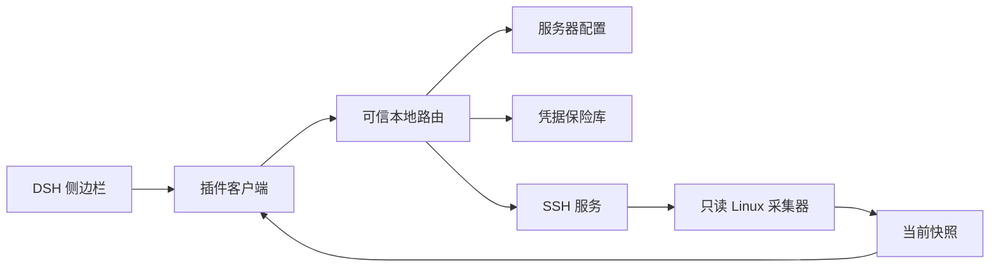

# 📦 @goodandready/dsh-server-monitor

<div align="center">

<h3>用于 DeepSeek Harness 侧边栏的独立只读 Linux 服务器监控器</h3>

<p align="center">
  <a href="https://www.npmjs.com/package/@goodandready/dsh-server-monitor"></a>
  <a href="LICENSE"></a>
  <a href="https://github.com/topics/dsh-plugin"></a>
  <a href="https://nodejs.org"></a>
</p>

<p align="center">
  <a href="https://goodandready.app/"></a>
</p>

<p align="center">
  <a href="README.md"><b>🇬🇧 English</b></a> •
  <a href="README.zh.md"><b>🇨🇳 中文说明</b></a> •
  <a href="README.ru.md"><b>🇷🇺 Русский</b></a>
</p>

<table align="center">
  <tr>
    <td align="center">
      ⭐ <strong>如果您觉得本插件对您有所帮助，请在 GitHub 上点亮 Star</strong> — 这能让我看到插件的实际价值，并激励我持续维护和完善它。
      <br><br>
      🐛 <strong>如果您在使用中遇到问题或有任何功能建议</strong>，欢迎随时在 GitHub 提交 Issue（支持任意语言）— 我会认真阅读每一条反馈并在后续版本中积极采纳。
    </td>
  </tr>
</table>

</div>

---

适用于 DeepSeek Harness 侧边栏的独立、只读 Linux 服务器监控插件。插件自行管理服务器配置和凭据，不依赖 `dsh-remote-workspace`，也不会复用其他插件的连接配置。

## MVP 范围

- 添加和管理 Linux、macOS、BSD 和 Windows OpenSSH 的 SSH 配置。
- 支持 SSH 私钥（内联内容或 DSH 主机上的密钥路径）以及密码认证。
- 直接在 UI 中生成 Ed25519 SSH 密钥对，提供一键复制的目标服务器部署命令并支持立即测试连接。
- 显示主机、CPU、内存、交换空间、磁盘、进程、容器、网络和监听端口的当前状态。
- 侧边栏可见时每 15 秒刷新一次。
- 后台探测不会管理远程服务、进程或容器。最近一小时画成迷你图，操作者可以打开一个交互终端。

## 凭据边界

凭据由本插件独立管理，保存在 DSH 主机上的专属保险库中。在 POSIX 主机上，插件会设置并验证仅所有者可访问的 `0600` 权限；无法确保权限时会停止操作。UI 生成的私钥存储于 `~/.dsh/keys/id_ed25519_dsh`，严格限制为 `0600` 权限（目录 `0700`）。密钥和私钥绝不写入 DSH 设置，也不会通过 API 返回给浏览器；配置接口只返回掩码和是否已保存的信息。私钥路径在 DSH 主机上读取。

## 开发测试

执行与 Gitea Actions 相同的检查：

```sh
npm ci
npm test
```

测试使用模拟 SSH 连接，不会连接真实服务器。Gitea Actions 会在推送和拉取请求时执行这些命令。

## 语言

界面内置英语和中文词典，并使用 DSH locale 服务，以便由 `dsh-russian-lang` 提供俄语翻译。另见 [README.md](README.md) 和 [README.ru.md](README.ru.md)。
## 环境要求

- 已安装插件的 DSH web 配置，且 DSH 主机可通过 SSH 访问 Linux 服务器。
- 远程账户可运行常见只读系统命令；容器数据需要有权查询 Docker/Podman。
- 私钥路径必须指向 DSH 主机上可由 DSH 服务账户读取的文件。
- **运行依赖 (`ssh2`)**：插件需要 `ssh2` (`^1.17.0`) 运行时依赖（位于 `dependencies`，而非 peer）以管理 SSH 会话和生成 Ed25519 密钥对。通过包管理器安装插件时会自动拉取。
- **纯 JavaScript 回退（Pure JS Fallback）**：DSH 主机上无需安装 C/C++ 编译器或 Python 构建工具链。虽然 `ssh2` 包含可选的原生加速模块（`cpu-features`、`sshcrypto`），但在缺少构建环境时会自动无缝回退到纯 JavaScript 实现。
- **离线环境部署（Air-Gapped）**：若在离线网络环境中通过 `.tgz` 包安装，请确保预先在本地包管理器缓存或私有 npm 镜像中提供 `ssh2` 及其传递依赖项。

## 安装

将 `web` 替换为所用的 DSH 配置：

```sh
dsh plugin --profile web add @goodandready/dsh-server-monitor
```

按 CLI 提示操作。在插件设置卡片中添加服务器，选择密钥或密码认证，测试并保存，然后在侧边栏打开 **Server Monitor**。卸载：`dsh plugin --profile web remove @goodandready/dsh-server-monitor`。

## 配置参考

请在 DSH 设置卡片中管理配置。从 SSH 配置导入会读取 `~/.ssh/config`，跳过通配和 git 主机，并让你选择要添加的主机。代理工具 `server_monitor_hosts` 和 `server_monitor_exec` 列出不含密钥的主机，并在 1–300 秒超时内执行一条非交互命令。设置仅包含连接元数据；不要将密码、私钥内容或口令写入设置或配置文件。

| 字段 | 类型 | 默认值 | 说明 |
| --- | --- | --- | --- |
| `profiles` | 数组 | `[]` | 本插件管理的 SSH 配置。 |
| `profiles[].id` | 字符串 | 自动生成 | 稳定配置 ID。 |
| `profiles[].name` | 字符串 | 空 | 显示名称。 |
| `profiles[].host` | 字符串 | 空 | DSH 可访问的 Linux 主机。 |
| `profiles[].port` | 数字 | `22` | SSH 端口。 |
| `profiles[].username` | 字符串 | `root` | 远程账户；建议限制权限。 |
| `profiles[].authType` | 字符串 | `key` | `key` 或 `password`。 |
| `profiles[].privateKeyPath` | 字符串 | 空 | DSH 主机上的可选密钥路径。 |
| `profiles[].shell` | 字符串 | `posix` | `posix` 把探测脚本通过标准输入交给 `/bin/sh -s`。`powershell` 使用 `powershell.exe -EncodedCommand`。 没有 `/proc/meminfo` 时用 sysctl 采集 macOS 和 BSD。Windows 请选择 `powershell`。 Terminal 按钮打开仅限本机的 xterm 会话。 |
| `profiles[].tags` | 字符串列表 | 空 | 逗号分隔的标签。服务器列表可按一个标签和搜索文本过滤。 |
| `profiles[].proxyJump` | 字符串 | 空 | 另一个配置的 ID，或 `user@host:port`。连接经该跳板建立。 |
| `activeProfileId` | 字符串 | 空 | 活动配置 ID。 |
| `pollIntervalSec` | 数字 | `30` | 后台探测间隔：`10`、`30`、`60` 或 `300`。其他值使用 `30`。 |

秘密值保存在 DSH 主机上由插件管理的保险库中。POSIX 系统要求文件权限验证为仅所有者可访问（`0600`）。

### SSH 密钥生成与跨插件共享

在设置卡片中，点击 **生成 SSH 密钥** 即可创建专属的 Ed25519 密钥对。私钥保存在 DSH 主机的 `~/.dsh/keys/id_ed25519_dsh`（权限 `0600`）。界面会展示公钥以及用于粘贴到目标服务器的一行式部署命令。执行命令后，点击 **已执行命令 — 测试连接** 即可立即验证连接连通性。

该私钥路径也可直接配置到其他本地插件中（例如 `dsh-remote-workspace`），复用同一管理密钥而无需重复设置凭据。

## 采集内容

有界只读采集器获取主机/操作系统/内核/CPU、负载和运行时间、内存与 swap、文件系统使用情况、最多 12 个 CPU 占用靠前的进程、运行中的 Docker 或 Podman 容器、网络计数器以及在主机上测得的一秒接收/发送速率及 TCP/UDP 监听端口（使用 `ss`，否则回退到 `netstat`）。命令、运行时或权限不可用时，相应区块可能为空。服务器卡片显示最近的 SSH 错误和探测延迟（毫秒）。历史保存在插件指标目录中，包含原始、1 分钟、15 分钟和 1 小时样本。`GET /dsh-server-monitor/history` 按时间范围返回一个字段。主机安装了 sysstat 时，第一次成功探测会从 `sar` 复制前一天的 CPU 和内存。本月流量按 UTC 日历月累加字节差；重启后计数器回绕不会倒扣，下月 1 日重新开始。每张服务器卡片用 SVG 画出最近一小时的 CPU、内存和磁盘。间隔超过 90 秒的点会断开折线。已知 CPU 核数时，CPU 按核数换算成百分比保存。

## 架构



| 模块 | 职责 |
| --- | --- |
| `lib/index.js` | Cordis 注册、设置集成和服务生命周期。 |
| `lib/client.js` | 侧边栏/设置界面；页面隐藏时暂停轮询。 |
| `lib/routes.js` | 可信请求校验、配置操作、快照缓存。 |
| `lib/profile.js` | 配置规范化和校验。 |
| `lib/vault-service.js` | 凭据保存及 POSIX 权限验证。 |
| `lib/ssh-service.js` | SSH 认证、有界命令、连接复用和清理。 |
| `lib/linux-collector.js` | 快照解析和 Linux `/proc` 探测。 |
| `lib/snapshot-commands.js` | macOS、BSD 和 Windows 的采集命令。 |
| `lib/pty-bridge.js` | 仅限本机的终端升级和 xterm 资源。 |
| `lib/agent-tools.js` | 列出主机并执行一条有界命令的代理工具。 |
| `lib/plugin-updater.js` | 版本检查以及在设置卡片中一键更新插件。 |

## 内部 HTTP 路由

这些路由只接受 loopback 客户端。Origin、Referer 和 Sec-Fetch-Site 只用于校验这台本机浏览器，不能让另一台机器通过。它们不是公开或远程管理 API。

| 方法 | 路径 | 用途 |
| --- | --- | --- |
| GET | `/dsh-server-monitor/state` | 清理后的配置和所选 ID。 |
| GET | `/dsh-server-monitor/snapshot?profileId=<id>` | 当前快照；默认活动配置。 |
| GET | `/dsh-server-monitor/update` | 当前及最新版本状态。 |
| POST | `/dsh-server-monitor/update` | 通过 DSH CLI 执行一键插件在线更新。 |
| POST | `/dsh-server-monitor/profiles/save` | 新建/更新配置。 |
| POST | `/dsh-server-monitor/profiles/delete` | 删除配置、凭据、SSH 会话和本地指标文件。 |
| POST | `/dsh-server-monitor/profiles/active` | 选择活动配置。 |
| POST | `/dsh-server-monitor/keys/generate` | 在 `~/.dsh/keys` 中生成 Ed25519 密钥对（权限 0600），并返回公钥与安装命令。 |
| POST | `/dsh-server-monitor/test` | 测试 SSH 连接。 |
| GET | `/dsh-server-monitor/history` | 一个配置和一个字段的历史采样。 |
| GET | `/dsh-server-monitor/profiles/import-ssh-config` | 本地 SSH 配置中的具体主机。 |
| GET | `/dsh-server-monitor/vendor/*` | 终端使用的 xterm 文件，仅限本机。 |
| WebSocket | `/dsh-server-monitor/pty` | 一个已保存主机的交互 shell，仅限本机。 |

快照按配置缓存 15 秒，并发请求共享同一次采集；保存或删除会清除该配置缓存。

## 安全、支持与许可证

插件独立管理 SSH 凭据，不把秘密返回浏览器。后台探测是只读的。Terminal 按钮打开一个交互 SSH 会话，升级只接受本机 loopback。不包含告警。

- 问题和建议：[GitHub Issues](https://github.com/GooDAnDReaDY/dsh-server-monitor/issues)
- 许可证：[MIT](LICENSE)
